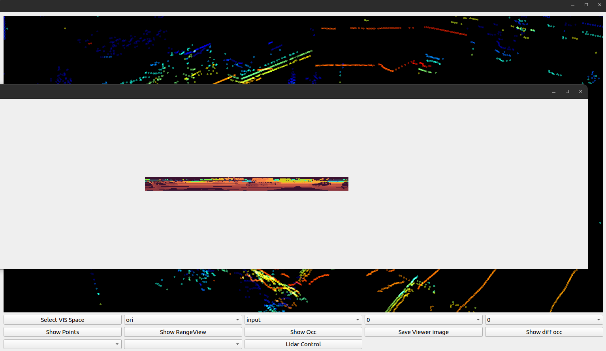

## Introduction

This project is an open-source initiative focused on point cloud forecasting and 4D occupancy forecasting. It encompasses the entirety of the training, testing, and inference procedures. The model's architecture is developed within the ***open4dpcf*** framework within our warehouse. Additionally, we have crafted an intuitive user interface for the purpose of visualizing various data structures like point clouds and occupancy grids, which are generated throughout the warehouse operations.


## Overview

<details open>
<summary>Major Features and Plans</summary>

- **Flexiable Code Design.**
  Open4DPCF decomposes 4DPCF algorithms into `methods` (training and prediction), `models` (network architectures), and `modules`, while providing unified experiment API. Users can develop their own 4DPCF algorithms with flexible training strategies and networks for different 4DPCF tasks.
- **Plans.**
  We plan to provide benchmarks of various 4DPCF methods and MetaFormer architectures based on various 4DPCF application tasks, e.g., point cloud novel view synthesis, 4D occupancy fprecasting, cross sensors generation, etc. We encourage researchers interested in 4DPCF to contribute to Open4DPCF or provide valuable advice!

</details>

<details open>
<summary>Code Structures</summary>

- `open4dpcf/api` contains an experiment runner.
- `open4dpcf/core` contains core training plugins and metrics.
- `open4dpcf/datasets` contains datasets and dataloaders.
- `open4dpcf/methods/` contains training methods for various methods.
- `open4dpcf/models/` contains the main network architectures of various methods.
- `open4dpcf/modules/` contains network modules and layers.
- `tools/` contains the executable python files `tools/train.py` ,`tools/inference.py`and `tools/test.py` with possible arguments for training, validating, and testing pipelines.

</details>


## News and Updates

[2024-06-11] [Open4DPCF](https://github.com/AlanLiangC/4DPCF) (`Open4DPCF`) is released.


## Installation

This project has provided an environment setting file of conda, users can easily reproduce the environment by the following commands:

```shell
git clone https://github.com/AlanLiangC/4DPCF
cd 4DPCF
python setup.py develop
```


## Getting Started

### Training

```shell
python ./tools/train.py --method YOUR_METHOD --model_name YOUR_MODELNAME --dataname DATASET --forecasting_time TIME --ex_name YOUR_EXP_NAME --local_rank GPU
```

Example:

```shell
python ./tools/train.py --method AL1 --model_name lstm --dataname nusc --forecasting_time 1s --ex_name Our_nusc_trainval_1s --local_rank 1
```

- ***method***: Various methodologies are utilized for distinct tasks. For instance, **AL1** within the project pertains to the 4D occupancy forecasting objective.
- ***model_name***: Each task is associated with multi models.

- ***dataname***: The dataset you use, like **nusc** (Nuscenes) and **kitti-od** (KITTI-Odometry).
- ***forecasting_time***: Details in `open4dpcf/datasets/dataset_constant.py`.
- ***ex_name***: The path of saved logs.

The config settings of different **methods**, **models** and **dataset** can be found at `./configs`.


## Testing 

```shell
python ./tools/test.py --method YOUR_METHOD --model_name YOUR_MODELNAME --dataname DATASET --forecasting_time TIME --ex_name YOUR_EXP_NAME --local_rank GPU --test
```

- ***test_from***: Location of pre-trained weights file.


## Inference 

```shell
python ./tools/inference.py --method YOUR_METHOD --model_name YOUR_MODELNAME --dataname DATASET --forecasting_time TIME --ex_name YOUR_EXP_NAME --local_rank GPU --inference_idx 10 --inference
```

- ***inference_idx***: Index of samples for inference.

After inferencing, the output will be saved in `work_dirs/vis_results`. The fold tree is like:

```
├── kitti_od
│   └── 3s
│       ├── 0
│       │   ├── lstm
│       │   ├── ori
│       │   └── rt
│       ├── 10
│       │   ├── lstm
│       │   ├── ori
│       │   └── rt
└── nusc
    └── 3s
        ├── 24
        │   └── lstm
        └── 25
            └── lstm

```


## Visualization

We have designed a user interface (UI) to display the results generated by ***Open4DPCF*** inference. For further information, please visit [VIS_4DPC](https://github.com/AlanLiangC/VIS_4DPC). We present visualization examples of SuPrNet below.

### Install

```shell
git clone https://github.com/AlanLiangC/VIS_4DPC
```

### Use

- open main window

`python main_window.py`


- Choose work space


- Show points


- Select model, task. batch index and timestamp


- Show range view



- Show occupancy


- Cross sensor generation
  - Nuscenes-KITTI


  - 
- Nuscenes-ArgoVerse


- multi-beam point cloud generation
  - 32-64 beam


- 
  - 32-128 beam


- NVS


<video src="./docs/vis/NVS.mp4"></video>


## License

This project is released under the [Apache 2.0 license](LICENSE). See `LICENSE` for more information.

## Acknowledgement

Open4DPCF is an open-source project for PCF algorithms created by researchers in **AlanLiang**. 

## Contribution and Contact

For adding new features, looking for helps, or reporting bugs associated with `Open4DPCF`, please open a GitHub issue and pull request with the tag "new features", "help wanted", or "enhancement". Feel free to contact us through email if you have any questions.

- [Alan Liang](https://alanliangc.github.io/), Shenyang Institute of Automation, Chinese Academy of Sciences

<p align="right">(<a href="#top">back to top</a>)</p>
